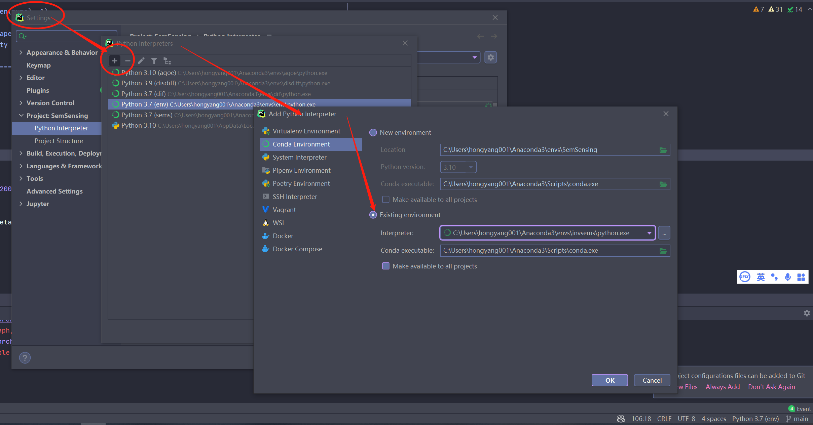
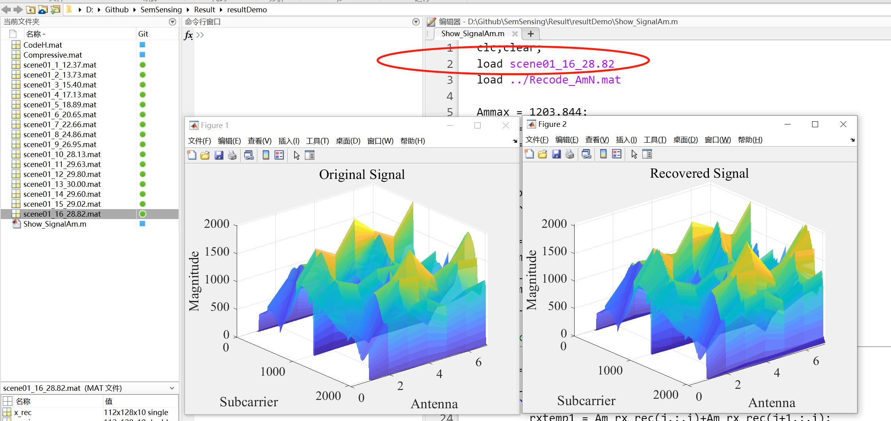

# Semantic Communications for Wireless Sensing: RIS-aided Encoding and Self-supervised Decoding

This repository hosts a demonstration of the encoder and decoder algorithm as presented in the paper "Semantic Communications for Wireless Sensing: RIS-aided Encoding and Self-supervised Decoding" by Hongyang Du, Jiacheng Wang, Dusit Niyato, Jiawen Kang, Zehui Xiong, Junshan Zhang, Xuemin (Sherman) Shen, accepted by IEEE JSAC.

The paper can be found [Here](https://arxiv.org/abs/2211.12727).


---

## 🔧 Environment Setup

To create a new conda environment, execute the following command:

```bash
conda create --name invsems python==3.8
```

## ⚡Activate Environment

Activate the created environment with:

```bash
conda activate invsems
```

## 📦 Install Required Packages

The following packages can be installed using pip:

```bash
pip install numpy
pip install scipy
pip install scikit-image
pip install torch
pip install torchvision
pip install opencv-python
pip install tqdm
```
Please pay attention to the torch version, according to your CUDA version. Refer to [here](https://pytorch.org/get-started/locally/).


## 🏃‍♀️ Run the Program

Set the created env as the runing env:



Run `main.py` to start the program.

## 🔍 Check the results

In this demo, we consider the encoding and decoing of wireless signal amplitude information as:

With the decoding process going, the results will be recorded:


After 2 decoding steps, the result is not good:


After 16 decoding steps, the result is quite good:



---

## Citation

```bibtex
@article{du2023semantic,
  title={Semantic communications for wireless sensing: RIS-aided encoding and self-supervised decoding},
  author={Du, Hongyang and Wang, Jiacheng and Niyato, Dusit and Kang, Jiawen and Xiong, Zehui and Zhang, Junshan and Shen, Xuemin},
  journal={IEEE Journal on Selected Areas in Communications},
  year={2023},
  publisher={IEEE}
}
```